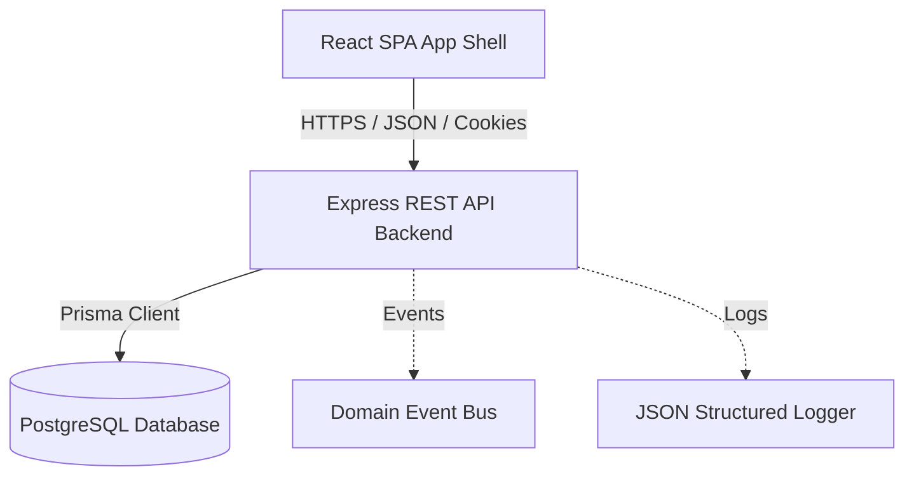
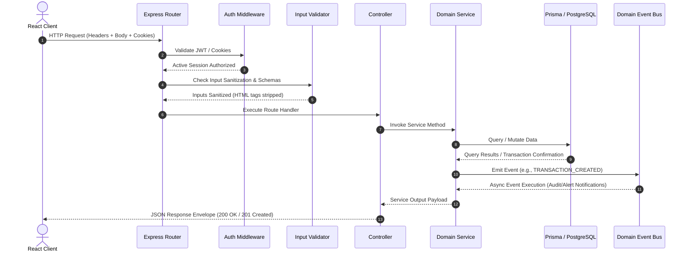
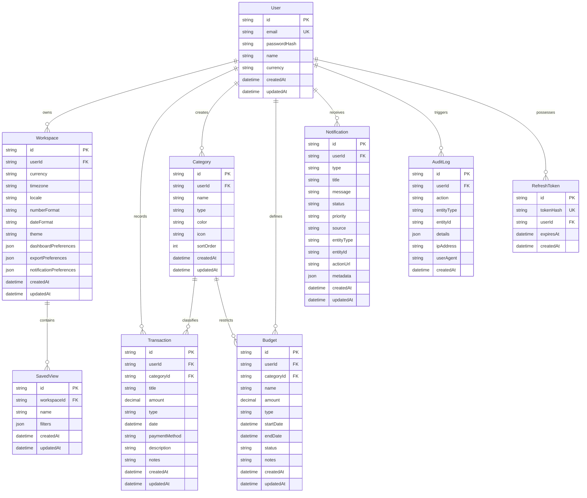

# System Architecture - ExpenseIQ

This document provides a high-level overview of the architectural framework of the ExpenseIQ system, documenting the structural patterns, decoupled components, and data integrations.

---

## 🏛️ High-Level System Architecture

ExpenseIQ utilizes a decoupled **Single Page Application (SPA)** client communicating with a stateless **RESTful API** backend. The backend persists transaction and budgeting logs in a **PostgreSQL** relational database layer via **Prisma ORM**. Automated build and deployment of the frontend static bundle is orchestrated via GitHub Actions workflows (`.github/workflows/deploy.yml`).

---

## 📊 Request Lifecycle & System Flow

Every client action follows a structured pipeline passing through security validation and event-driven updates.

---

## 💾 Database Entity-Relationship (ER) Diagram

The PostgreSQL relational structure is mapped below, demonstrating key-relationship cascades, unique indices, and database constraints.

