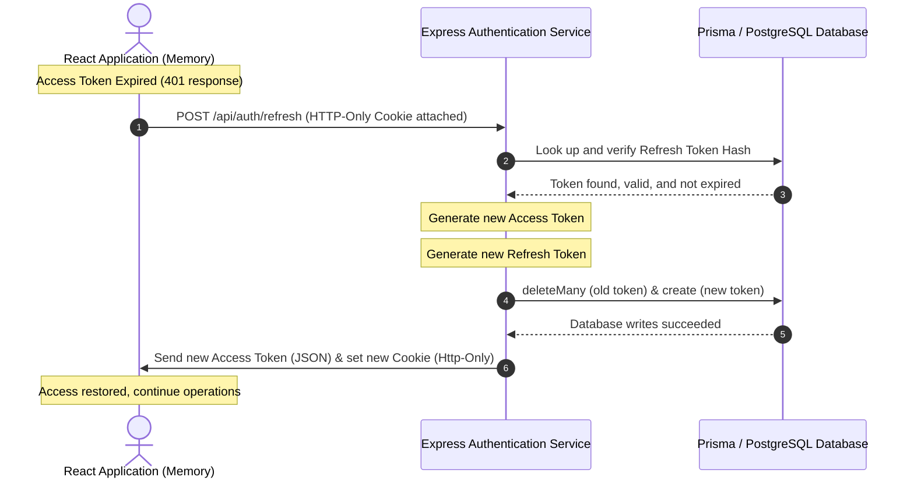

# Authentication & Session Security - ExpenseIQ

ExpenseIQ utilizes a hardened, stateless **JWT-based authentication** protocol with a dual-token (Access/Refresh) architecture to isolate session logic and protect against common client-side theft vectors.

---

## 🔐 Dual-Token Architecture Overview

1.  **Access Token:**
    *   **Lifetime:** Short-lived (typically 15 minutes).
    *   **Transmission:** Kept strictly in client memory (React application state) and attached as an `Authorization: Bearer <token>` header on API requests.
    *   **Storage:** Never written to `localStorage` or `sessionStorage` to mitigate Cross-Site Scripting (XSS) extraction.
2.  **Refresh Token:**
    *   **Lifetime:** Long-lived (7 days).
    *   **Transmission:** Transported in HTTP-only, secure, SameSite cookies.
    *   **Storage:** Stored as a hashed representation in the database `RefreshToken` model.

---

## 📡 Cookie Specifications

To safeguard refresh token transactions, session cookies are configured with strict parameters in the response headers:

```typescript
const COOKIE_OPTIONS = {
  httpOnly: true,               // Blocks access from client-side JavaScript APIs (prevents XSS theft)
  secure: true,                 // Restricts cookie transfers to HTTPS channels only (development bypasses this locally)
  sameSite: 'strict' as const,  // Blocks CSRF transmissions by disabling cookies on cross-origin requests
  maxAge: 7 * 24 * 60 * 60 * 1000, // 7-day expiration
  path: '/api/auth',            // Cookie is only sent to the authentication endpoint routes
};
```

---

## 🔄 Token Rotation Flow

When the Access Token expires, the client sends a POST request to `/api/auth/refresh`. The server validates the cookie token hash, rotates both access/refresh tokens, invalidates the old refresh token, and issues new sessions.



---

## 🚫 Attack Vector Protections

*   **Replay Attack Mitigation:** If a refresh token is reused, the rotation step fails because the old token was deleted via `deleteMany` inside the database.
*   **CSRF Prevention:** Restricting cookie scopes via `SameSite: strict` and the narrow `path: '/api/auth'` prevents malicious origins from triggering authorization cycles silently.
*   **Race Conditions:** Utilizing `deleteMany` instead of standard `delete` prevents 500 error crashes under high-frequency concurrent token updates.
